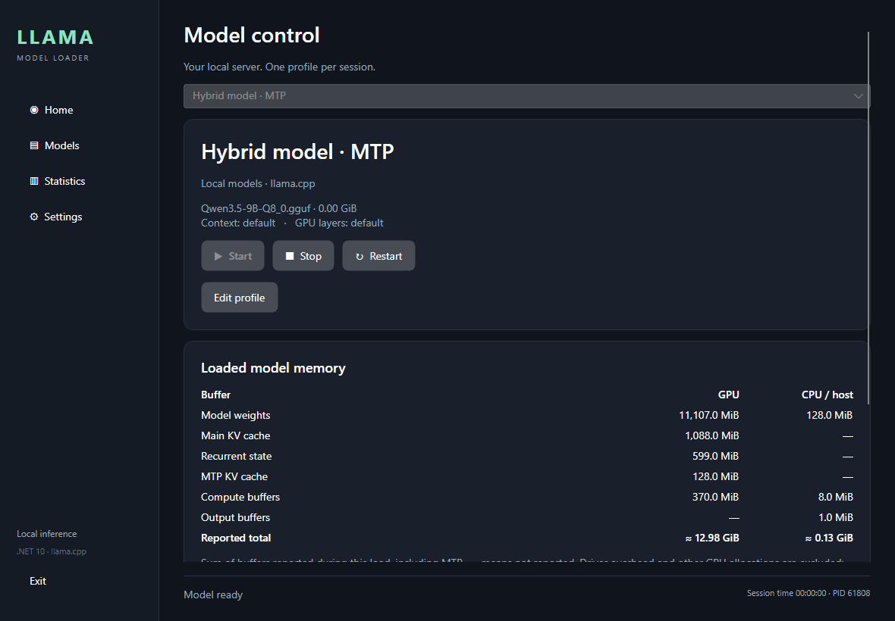
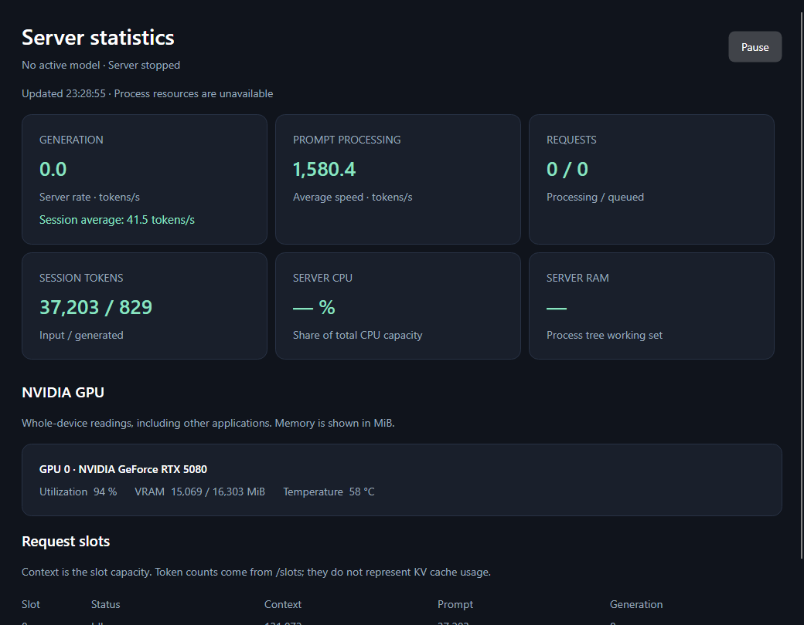

# Llama Model Loader

A Windows desktop app for running local GGUF models with [llama.cpp](https://github.com/ggml-org/llama.cpp). Save launch profiles, switch models, and monitor your server from one interface.

Built with **.NET 10**, **Avalonia**, and **CommunityToolkit.Mvvm**. The interface is in English.



*Screenshots use demo data from automated UI checks; the displayed values are not model benchmarks.*

## Features

- **Server controls:** start, stop, and restart the selected model; open the server Web UI or copy its API address.
- **Model profiles:** add, edit, duplicate, and delete profiles. Browse your models folder or select a GGUF file directly.
- **Launch settings:** configure context size, GPU layers, CPU threads, batching, Flash Attention, KV cache types, sampling, and chat options.
- **Speculative decoding:** configure the method, maximum draft tokens, and minimum draft probability, including `draft-mtp` for compatible models.
- **Memory breakdown:** see model weights, main KV cache, recurrent state, MTP KV cache, and compute buffers, with separate GPU and CPU/host totals.
- **Server statistics:** generation speed, session average, prompt processing, token counters, requests, slots, CPU, RAM, and NVIDIA GPU telemetry.
- **Desktop integration:** system tray controls, start with Windows, start minimized, and automatic model startup.
- **Persistent configuration:** saved profiles, atomic writes, a backup configuration, and rotating server logs.

## Requirements

| Component | Requirement |
| --- | --- |
| Operating system | Windows x64 |
| Inference server | A local `llama-server.exe` installation with its required backend libraries |
| Model | A GGUF model supported by that server build |
| Build from source | .NET SDK **10.0.401**, or a newer patch allowed by [global.json](global.json) |
| NVIDIA telemetry | `nvidia-smi` available to the application |
| Request script | Windows PowerShell 5.1 or PowerShell 7 |

The application does not bundle llama.cpp or model weights. GPU support comes from your llama.cpp installation; the loader launches the executable you select. A self-contained application build includes the .NET runtime.

## Build and run

From the repository root:

```powershell
dotnet restore LLamaModelLoader.slnx
dotnet build LLamaModelLoader.slnx -c Release -m:1
dotnet run --project src/LLamaModelLoader.Desktop -c Release --no-build
```

To create a standalone Windows distribution:

```powershell
dotnet publish src/LLamaModelLoader.Desktop -c Release -r win-x64 --self-contained true -o artifacts/app -m:1
Compress-Archive -Path artifacts/app/* -DestinationPath artifacts/LLamaModelLoader-win-x64.zip -Force
```

Launch `LLamaModelLoader.Desktop.exe` from the published folder. Keep all files in that folder together. When switching builds, close the previous instance using **Exit** first; saved profiles are reused automatically.

## Quick start

1. Open **Settings**, choose `llama-server.exe`, and set your models folder.
2. Open **Models → Add model**. Select a GGUF file, give the profile a name, and save it.
3. On **Home**, select the profile and click **Start**.
4. Wait for **Model ready**, then open the Web UI or connect a client to `http://127.0.0.1:8080/v1`.
5. Use **Statistics** to inspect the running server. After editing a profile, use **Restart** to apply the changes.

The port is configurable. The server binds to loopback for local access. Multiple profiles may use the same model file; deleting a profile leaves the weights on disk. For a split GGUF, select the first `00001` shard.

Closing the window hides the application in the system tray when the tray is available. **Exit** or **Exit and stop server** closes the application and terminates its server process tree. **Stop**, **Restart**, and **Exit** interrupt unfinished requests. Only one application instance and one managed server run at a time.

## Model settings

| Section | Options |
| --- | --- |
| General | Context size, GPU layers |
| Performance | Generation and prompt threads, batch and microbatch sizes |
| Speculative decoding | Method, maximum draft tokens, minimum draft probability |
| Memory | Flash Attention, K/V cache types, memory loading mode, GPU memory fitting |
| Generation | Temperature, Top K, Top P, Min P, penalties, seed, maximum new tokens |
| Chat | Chat template, Jinja, reasoning mode |
| Advanced | Parallel request slots |

An empty field uses the server default. The editor shows an argument preview, and startup checks selected flags against the installed executable's `--help`. llama.cpp validates model compatibility and option values during loading; failures appear in **Server log**.

For additional options, enter one CLI token per line in **Additional arguments**, without surrounding quotes. Application-managed arguments cannot be overridden there.

### API model name

The profile's **Name** is passed as `--alias`. A profile named `My local model` appears with that ID in `/v1/models`, instead of its GGUF path. Use the same name in your client's `model` field. Renaming takes effect after restarting the server. Commas are not allowed in profile names because llama.cpp uses them to separate aliases.

### MTP example

For a server build and model that support MTP, configure:

| Field | Value |
| --- | --- |
| General → GPU layers | `99` |
| Speculative decoding → Method | `draft-mtp` |
| Maximum draft tokens | `2` |
| Minimum draft token probability | `0.60` |

These settings produce `--gpu-layers 99 --spec-type draft-mtp --spec-draft-n-max 2 --spec-draft-p-min 0.6`. MTP requires compatible weights; enabling the option alone does not make a model compatible.

## Memory and statistics

**Loaded model memory** appears in Model control after loading. It reads allocation messages from the current launch and separates GPU memory from CPU/host buffers. Rows use MiB; reported totals use GiB. Main and MTP compute buffers are combined, while their KV caches are shown separately.

The application enables `--log-verbosity 4` when supported, unless you explicitly set verbosity or disable logging. Clearing the visible log preserves the breakdown; a new launch collects fresh values. A dash means a value was not reported. Totals can be partial and exclude driver overhead and other allocations. Host mappings do not represent resident RAM usage.

<details>
<summary>Server statistics preview</summary>



*Demo data, including an idle generation rate and the retained session average.*

</details>

**Statistics** refreshes every two seconds while open and not paused. It displays:

- Generation and prompt processing rates, token counters, and active/queued requests from `/metrics`.
- Request slots and context capacity from `/slots`.
- CPU and RAM for the managed server process tree.
- NVIDIA utilization, VRAM, and temperature through `nvidia-smi`. GPU readings cover the entire device, including other applications.

The **Session average** divides total generated tokens by total generation time. Idle time does not lower this value. It persists when the statistics window is reopened and resets with the server session. Counters may update only after a request finishes.

The application enables `--metrics` when supported. Unavailable metrics appear as a dash. See the [llama-server reference](https://github.com/ggml-org/llama.cpp/blob/master/tools/server/README.md) for API details.

## Send a request with workspace context

While a model is running, use [scripts/Ask-Llama.ps1](scripts/Ask-Llama.ps1):

```powershell
.\scripts\Ask-Llama.ps1 -WorkingDirectory 'C:\Projects\MyApp' -Prompt 'Suggest a test plan.'

.\scripts\Ask-Llama.ps1 -WorkingDirectory 'C:\Projects\MyApp' -Files README.md, src/App.cs -Prompt 'Review these files.'
```

The script discovers the model ID automatically. Optional parameters include `-Model`, `-BaseUrl`, `-MaxTokens`, `-TimeoutSeconds`, and `-RawResponse`.

`WorkingDirectory` supplies prompt context. Only files explicitly listed in `-Files` are attached, with a combined 1 MiB limit. The script does not scan the folder, grant filesystem access, execute responses, or modify files.

## Configuration and logs

| Data | Default location |
| --- | --- |
| Configuration | `%LOCALAPPDATA%\LLamaModelLoader\config.json` |
| Configuration backup | `%LOCALAPPDATA%\LLamaModelLoader\config.json.bak` |
| Server logs | `%LOCALAPPDATA%\LLamaModelLoader\logs\` |

Set `LLAMAMODELLOADER_DATA_DIR` to use a different data directory. Configuration writes are atomic; damaged files are preserved during recovery. The application reads configuration schemas 1 and 2 and saves schema 2.

The visible log keeps the last 500 lines. File logs rotate independently. Profile names, descriptions, paths, and external server output retain their original language.

## Development and tests

Run the .NET test suite and PowerShell compatibility checks:

```powershell
dotnet test tests/LLamaModelLoader.Tests -c Release -m:1
powershell.exe -NoProfile -File tests/ScriptChecks/Test-AskLlama.ps1
pwsh -NoProfile -File tests/ScriptChecks/Test-AskLlama.ps1
```

Tests use a local fixture server and temporary model placeholders; no downloaded weights or GPU are required. Localhost and test-runner IPC access are needed.

Render the interface and exercise its controls without a visible window:

```powershell
dotnet build LLamaModelLoader.slnx -c Release -m:1
dotnet run --project tests/SmokeChecks -c Release --no-build -- render artifacts/screenshots
```

An optional real-model smoke check starts a separate server on port `18089`, sends an inference request, restarts it, and stops it:

```powershell
dotnet run --project tests/SmokeChecks -c Release --no-build -- real 'D:\llama_cpp\llama-server.exe' 'D:\Models\model.gguf' artifacts/real-smoke
```

| Project | Responsibility |
| --- | --- |
| `src/LLamaModelLoader.Core` | Configuration, model options, arguments, statistics, and memory data |
| `src/LLamaModelLoader.Infrastructure` | Persistence, model catalog, process lifecycle, API polling, log parsing, and Windows integration |
| `src/LLamaModelLoader.Desktop` | Avalonia views, view models, and system tray |
| `tests` | Unit and integration tests, fixture server, script checks, and UI smoke checks |

## Current scope

This version manages one local server. Model downloads, llama.cpp installation or updates, LAN hosting, multiple simultaneous servers, and an integrated chat are not implemented. GPU telemetry currently supports NVIDIA only. Available launch options and memory details depend on the selected llama.cpp build.

For implementation notes and verification results, see the [MVP plan](docs/mvp-plan.md), [llama.cpp option research](docs/llama-server-research.md), and [verification report](docs/verification.md).

## Acknowledgments

Built on [llama.cpp](https://github.com/ggml-org/llama.cpp), [Avalonia](https://github.com/AvaloniaUI/Avalonia), and [CommunityToolkit.Mvvm](https://github.com/CommunityToolkit/dotnet). These dependencies and model weights have their own licenses.
